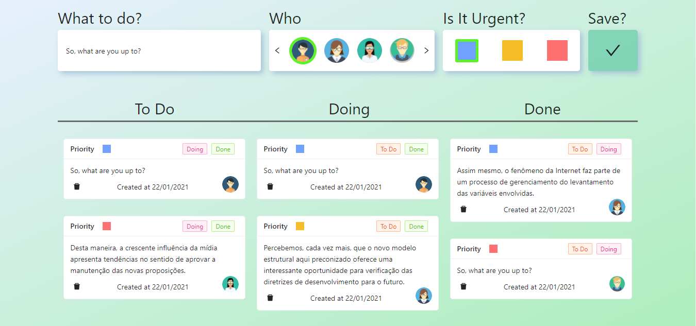

<p align="center">
  

  

  
  <a href="https://github.com/paulop2/Happy-NLW3/commits/master">
    
  </a>
    
   
   <a href="https://github.com/paulop2/Happy-NLW3/stargazers">
    
  </a>

  <a href="https://blog.rocketseat.com.br/como-fazer-um-bom-readme/">
    
  </a>

</p>


<h1 align="center">
     
    <p align="center">
    <strong >V4T - To do list</strong>
    </p>
    
</h1>

<p align="center">
  
</p>


<h4 align="center">
	🚀 Venturus4Tech - Concluído 🚀 
</h4>

<p align="center">
 <a href="#-sobre-o-projeto">Sobre</a> •
 <a href="#-funcionalidades">Funcionalidades</a> •
 <a href="#-layout">Layout</a> • 
 <a href="#-como-executar-o-projeto">Como executar</a> • 
 <a href="#-tecnologias">Tecnologias</a> • 
 <a href="#-autor">Autor</a> • 
 <a href="#user-content--licença">Licença</a>
</p>


## 💻 Sobre o projeto

 Happy - é um To Do List para ajudar na organização de tarefas.


Projeto desenvolvido durante a **V4T 9 - Venturus 4 Tech 9ª edição** oferecida pela [Rocketseat](https://www.venturus.org.br/).
O V4T tem como foco compartilhar conhecimento com a comunidade e construir uma aplicação web para que apresentar alguns conceitos e tecnologias interessantes, como o Firebase.

---

## ⚙️ Funcionalidades

- [x] Tarefas podem ser cadastradas como:
  - [x] Texto; 

- [x] O usuário pode:
  - [x] Alterar o Status de uma tarefa;
    - [x] To do;
    - [x] Doing;
    - [x] Done;
  - [x] Excluir uma tarefa (modificação);
  - [x] Selecionar o responsável;
  - [x] Selecionar a urgência.


---

## 🎨 Layout

O layout da aplicação está disponível na Vercel:            <a align=center href="https://v4t-2021-todo-list-eptw63fn1.vercel.app/">
  
</a>


---

## 🚀 Como executar o projeto

Este projeto é um mono-repo!

### Pré-requisitos

Antes de começar, você vai precisar ter instalado em sua máquina as seguintes ferramentas:
- [Git](https://git-scm.com), 
- [Node.js](https://nodejs.org/en/),
- [Yarn](https://classic.yarnpkg.com/).

Além disto é bom ter um editor para trabalhar com o código como [VSCode](https://code.visualstudio.com/)

#### 🎲 Rodando o projeto

```bash

# Clone este repositório
$ git clone git@github.com:paulop2/v4t-2021-todo-list.git

# Acesse a pasta do projeto no terminal/cmd
$ cd v4t-2021-todo-list

# Instale as dependências
$ yarn

# Execute a aplicação em modo de desenvolvimento
$ yarn start

# O servidor inciará na porta:3333 - acesse http://localhost:3000 

```


---

## 🛠 Tecnologias

As seguintes ferramentas foram usadas na construção do projeto:

#### **Website**  ([React](https://reactjs.org/) 

-   **[Ant Design](https://ant.design/)**
-   **[Axios](https://github.com/axios/axios)**
-   **[Styled Components](https://styled-components.com/)**

> Veja o arquivo  [package.json](https://github.com/paulop2/v4t-2021-todo-list/blob/main/package.json)

#### **Backend**  ([NodeJS](https://nodejs.org/en/)

-   **[Firebase](https://firebase.google.com/?hl=pt-br)**

#### **Utilitários**

-   Editor:  **[Visual Studio Code](https://code.visualstudio.com/)**
-   Teste de API:  **[Insomnia](https://insomnia.rest/)**
-   Ícones:  **[Ant Design](https://ant.design/components/icon/#header)**


---
## 💪 Como contribuir para o projeto

1. Faça um **fork** do projeto.
2. Crie uma nova branch com as suas alterações: `git checkout -b my-feature`
3. Salve as alterações e crie uma mensagem de commit contando o que você fez: `git commit -m "feature: My new feature"`
4. Envie as suas alterações: `git push origin my-feature`


---

##  Autor


 <sub><b>Paulo Vitor de Souza</b></sub></a> <a href="https://blog.rocketseat.com.br/author/thiago/" title="Rocketseat"></a>
 <br />

[](https://www.linkedin.com/in/paulop2-vs/) 
[](mailto:paulo225vitor@gmail.com)

<!-- Corrigir o link para o linkedin -->

---

## 📝 Licença

Este projeto esta sobe a licença [MIT](./LICENSE).

---

##  Versões do README

[🚧Português 🇧🇷🚧](./README.md)

## Direitos de imagem

<div>Icone por <a href="https://www.flaticon.com/authors/ultimatearm" title="ultimatearm">ultimatearm</a> from <a href="https://www.flaticon.com/" title="Flaticon">www.flaticon.com</a></div>
